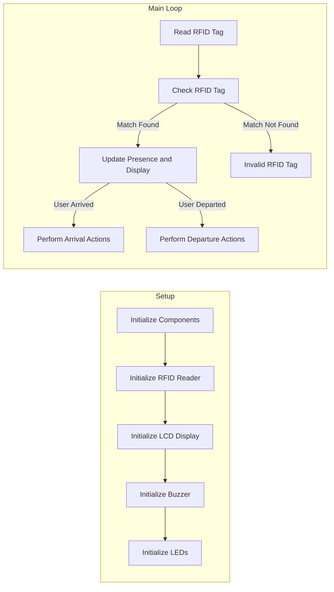

# RFID Attendance System README

This repository contains the code for an RFID attendance system. The system utilizes an RFID reader, LCD display, buzzer, and LEDs to track and display the attendance status of users.

## Introduction

The RFID Attendance System allows users to register their attendance by swiping their RFID cards or tags. The system keeps track of user presence, updates attendance records, and provides visual and audible feedback to the users.

## Code Explanation

The code is written in Arduino programming language and consists of a main loop that reads the RFID tag from the RFID reader and performs actions based on the tag's value. It utilizes the Arduino IDE and the MFRC522 library for RFID communication.

The main loop follows the following steps:

1. **Initialize Components**: The necessary components such as the RFID reader, LCD display, buzzer, and LEDs are initialized.

2. **Read RFID Tag**: The system reads the RFID tag from the RFID reader module. The RFID reader communicates with the microcontroller via serial communication.

3. **Check RFID Tag**: The system compares the received RFID tag with a predefined set of known user tags to determine if there is a match.

4. **Match Found**:
   - If the user is not present or has departed:
     - The user's presence status is updated, indicating that the user has arrived.
     - A welcome message is displayed on the LCD display.
     - The buzzer and green LED are activated briefly to provide audio and visual feedback.
     - The arrival time is recorded in the EEPROM memory for attendance tracking.
   - If the user is already present:
     - The user's presence status is updated, indicating that the user has departed.
     - A goodbye message is displayed on the LCD display.
     - The buzzer and green LED are activated briefly to provide audio and visual feedback.
     - The departure time is recorded in the EEPROM memory for attendance tracking.

5. **Match Not Found**: If the received RFID tag does not match any known user tags, an invalid tag message is displayed on the LCD display.

6. The main loop repeats to continue reading RFID tags and processing attendance.

## Pin Connection

The code assumes the following pin connections between the components and the microcontroller:

| Component      | Pin Connection |
| -------------- | -------------- |
| RFID Reader    | (RX, TX)       |
| LCD Display    | (RS, E, D4-D7) |
| Buzzer         | Digital Pin    |
| Green LED      | Digital Pin    |
| Red LED        | Digital Pin    |

Note: Please refer to the specific datasheets and documentation of your components for accurate pin connections and any additional wiring requirements.

## Flowchart

The following is a textual representation of the flowchart illustrating the main logic of the code:

## Further Customization

The code provided is a starting point for building an RFID attendance system. You

 can customize it according to your specific requirements and hardware setup. Some possible enhancements include:

- Adding a database or external storage for storing attendance records.
- Implementing additional features like user authentication, time scheduling, or generating reports.
- Integrating with a web server or cloud platform for remote access and data management.

Feel free to modify and enhance the code to meet your needs.

## Troubleshooting

If you encounter any issues or have questions regarding the RFID Attendance System, please refer to the troubleshooting section in the project's documentation. You can also seek support from the community or open an issue on the repository page.

---

We hope you find this RFID Attendance System useful for your attendance tracking needs. If you have any suggestions or feedback, please let us know. Happy coding!
