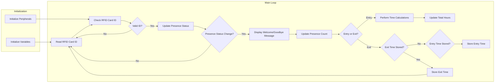

# RFID Attendance System README

This repository contains the code for an RFID attendance system. The system utilizes an RFID reader, LCD display, buzzer, and LEDs to track and display the attendance status of users.

## Description

The RFID Attendance System is an Arduino-based project that allows for tracking the attendance of individuals using RFID cards. This system utilizes an RFID reader to scan RFID card IDs and displays relevant information on an LCD screen. The code provided implements the core functionality of the system, including card scanning, presence tracking, and data storage.

## Code Explanation

The code is written in Arduino programming language and consists of a main loop that reads the RFID tag from the RFID reader and performs actions based on the tag's value. It utilizes the Arduino IDE and the MFRC522 library for RFID communication.

The main loop follows the following steps:

1. **Initialize Components**: The necessary components such as the RFID reader, LCD display, buzzer, and LEDs are initialized.

2. **Read RFID Tag**: The system reads the RFID tag from the RFID reader module. The RFID reader communicates with the microcontroller via serial communication.

3. **Check RFID Tag**: The system compares the received RFID tag with a predefined set of known user tags to determine if there is a match.

4. **Match Found**:
   - If the user is not present or has departed:
     - The user's presence status is updated, indicating that the user has arrived.
     - A welcome message is displayed on the LCD display.
     - The buzzer and green LED are activated briefly to provide audio and visual feedback.
     - The arrival time is recorded in the EEPROM memory for attendance tracking.
   - If the user is already present:
     - The user's presence status is updated, indicating that the user has departed.
     - A goodbye message is displayed on the LCD display.
     - The buzzer and green LED are activated briefly to provide audio and visual feedback.
     - The departure time is recorded in the EEPROM memory for attendance tracking.

5. **Match Not Found**: If the received RFID tag does not match any known user tags, an invalid tag message is displayed on the LCD display.

6. The main loop repeats to continue reading RFID tags and processing attendance.

## Requirements
To run this code and set up the RFID Attendance System, you will need the following components:
- Arduino board (e.g., Arduino Uno)
- RFID reader module and compatible RFID cards
- LCD display (compatible with the LiquidCrystal library)
- Buzzer and LED (optional for providing feedback)

## Installation and Setup
1. Connect the RFID reader to the Arduino board using the appropriate pins (refer to the code for pin assignments).
2. Connect the LCD display to the Arduino board using the necessary connections (refer to the code for pin assignments).
3. If using a buzzer and LED for feedback, connect them to the appropriate pins as specified in the code.
4. Install the necessary libraries for the RFID reader and LCD display. You can find the required libraries and installation instructions on the respective library repositories.
5. Upload the provided code to the Arduino board using the Arduino IDE or any compatible software.

## Pin Connection

| Component  | Pin/Connection | Purpose                         |
|------------|----------------|---------------------------------|
| RFID Reader|                |                                 |
|------------|----------------|---------------------------------|
| RST        | Digital Pin 9  | Reset pin for the RFID reader   |
| SDA (SS)   | Digital Pin 10 | Serial data line for the reader |
| MOSI       | Digital Pin 11 | Master Out Slave In for SPI     |
| MISO       | Digital Pin 12 | Master In Slave Out for SPI     |
| SCK        | Digital Pin 13 | Serial Clock for SPI            |
|------------|----------------|---------------------------------|
| LCD Display|                |                                 |
|------------|----------------|---------------------------------|
| RS         | Digital Pin 2  | Register Select pin for LCD     |
| EN         | Digital Pin 3  | Enable pin for LCD              |
| D4         | Digital Pin 4  | Data line 4 for LCD             |
| D5         | Digital Pin 5  | Data line 5 for LCD             |
| D6         | Digital Pin 6  | Data line 6 for LCD             |
| D7         | Digital Pin 7  | Data line 7 for LCD             |
|------------|----------------|---------------------------------|
| Buzzer     | Analog Pin 9   | Control pin for the buzzer      |
|------------|----------------|---------------------------------|
| Green LED  | Digital Pin 8  | Control pin for the green LED   |

Please note that the table assumes the use of standard Arduino pin numbering. Make sure to cross-check the pin connections with your specific hardware setup before implementing the code.

## Usage

1. Make sure the RFID reader is powered on and the RFID cards are within range.
2. When a card is scanned, the system will check the card's ID against the stored IDs and perform the following actions:
   - If the card ID is recognized and the associated user is not currently marked as present, the system will mark the user as present, display a welcome message on the LCD, sound the buzzer, and turn on the LED.
   - If the card ID is recognized and the associated user is already marked as present, the system will mark the user as absent, display a goodbye message on the LCD, sound the buzzer, and turn on the LED.
   - If the card ID is not recognized, the system will ignore it.
3. The system will update the presence count and store the presence data in the EEPROM memory.
4. The total hours and minutes of presence for each user will be calculated and stored in the EEPROM memory.
5. The LCD display will provide relevant information and feedback during the operation of the system.

## Flowchart

Explanation of the flowchart:

1. Initialization: In this section, variables are initialized, and peripherals such as the LCD display, RFID reader, and buzzer are set up.

2. Main Loop: This section represents the main loop of the program. The following steps are performed repeatedly:

   - Read RFID Card ID (C): The RFID reader reads the ID of the scanned card.
   - Check RFID Card ID (D): The code checks if the scanned RFID card ID matches any of the stored card IDs.
   - Valid ID? (E): If the ID is valid, the code proceeds to update the presence status; otherwise, it goes back to reading the RFID card ID.
   - Update Presence Status (F): The presence status of the user associated with the scanned card is updated based on their current presence status.
   - Presence Status Change? (G): If there is a change in the presence status (entry or exit), the code proceeds to display the corresponding welcome or goodbye message; otherwise, it goes back to reading the RFID card ID.
   - Display Welcome/Goodbye Message (H): The LCD display shows a welcome message if the user entered or a goodbye message if the user exited.
   - Update Presence Count (I): The presence count is incremented or decremented based on the user's entry or exit.
   - Entry or Exit? (J): The code determines if the user is entering or exiting based on the presence status.
   - Perform Time Calculations (K): If it's an entry, the code calculates the duration of the user's presence by comparing the current time with the stored entry time.
   - Update Total Hours (L): The total hours of presence are updated by adding the calculated duration to the existing total.
   - Entry Time Stored? (M): If the user entered, the code checks if the entry time is already stored.
   - Store Entry Time (N): If the entry time is not stored, it is stored in EEPROM memory.
   - Exit Time Stored? (O): If the user exited, the code checks if the exit time is already stored.
   - Store Exit Time (P): If the exit time is not stored, it is stored in EEPROM memory.

The program continues to loop through these steps, scanning RFID cards, updating presence status, storing entry/exit times, calculating duration, and updating total hours until interrupted or stopped.

## Features

- Supports up to 10 different RFID cards and associated names.
- Tracks the entry and exit times of users.
- Calculates the total hours and minutes of presence for each user.
- Stores presence data in non-volatile EEPROM memory.
- Provides visual feedback through an LCD display, buzzer, and LED.

## Customization

- To add or remove RFID cards and associated names, modify the `rfid_id[]` and `names[]` arrays in the code, respectively. Ensure that the array sizes and indices match appropriately.
- Adjust the pin assignments in the code to match your specific hardware setup.
- Customize the LCD messages, buzzer tones, LED behavior, and other visual or auditory feedback according to your preferences.

## Further Customization

The code provided is a starting point for building an RFID attendance system. You can customize it according to your specific requirements and hardware setup. Some possible enhancements include:

- Adding a database or external storage for storing attendance records.
- Implementing additional features like user authentication, time scheduling, or generating reports.
- Integrating with a web server or cloud platform for remote access and data management.

Feel free to modify and enhance the code to meet your needs.

## Troubleshooting

If you encounter any issues or errors while using the RFID Attendance System, consider the following steps:
- Double-check the connections between the Arduino board, RFID reader, LCD display, buzzer, and LED.
- Verify that the required libraries for the RFID reader and LCD display are properly installed.
- Ensure that the RFID cards are compatible with the RFID reader module.
- Review the code for any potential logical or syntax errors.
- Use the serial monitor or other debugging techniques to check for any error messages or unexpected behavior.
- You can also seek support from the community or open an issue on the repository page.
